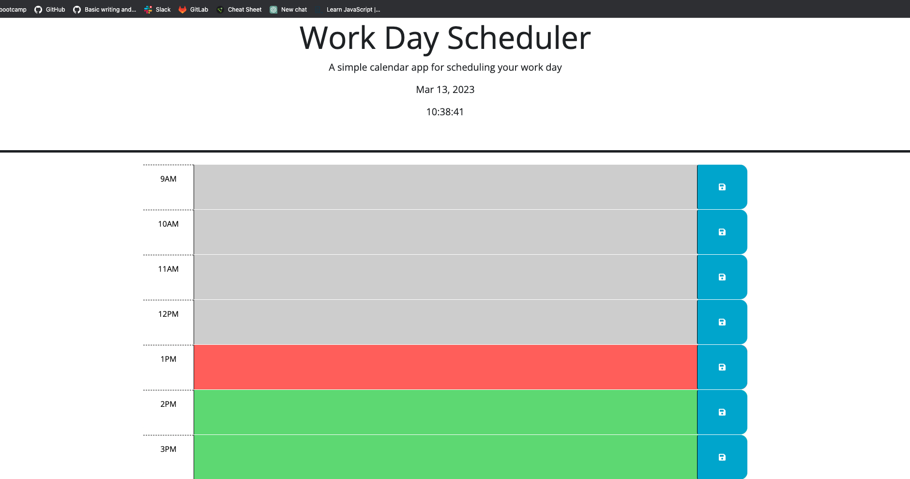
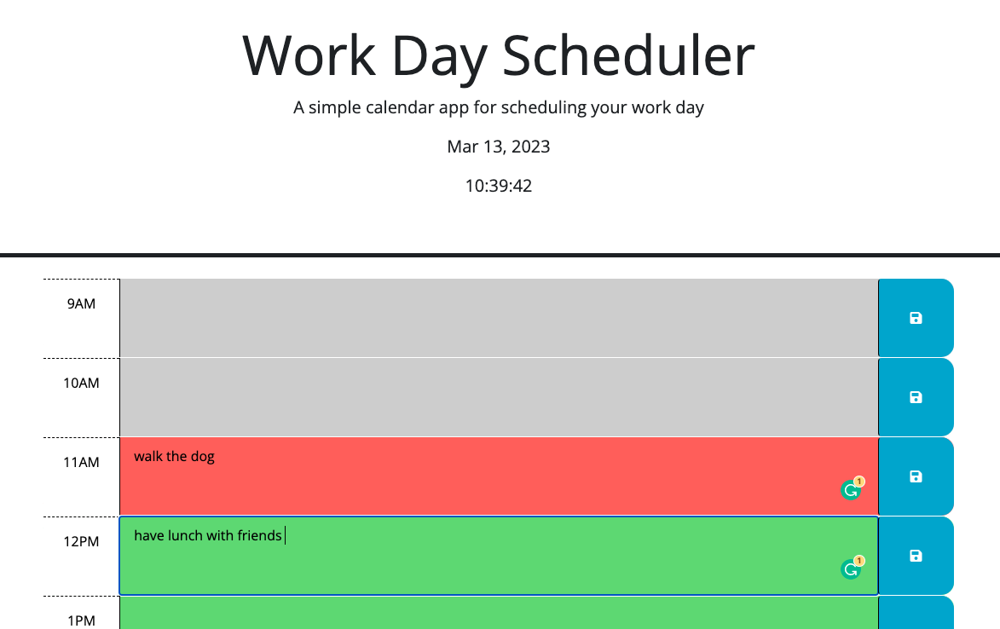
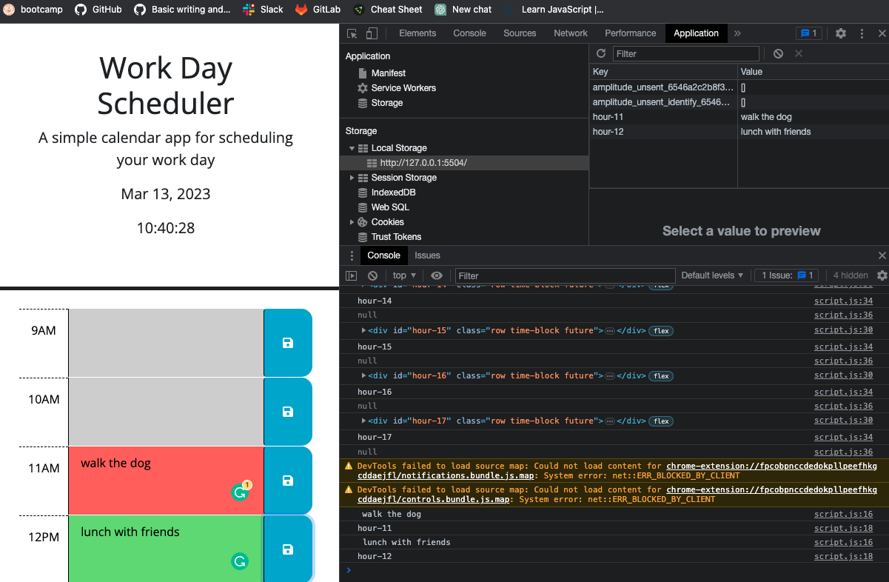
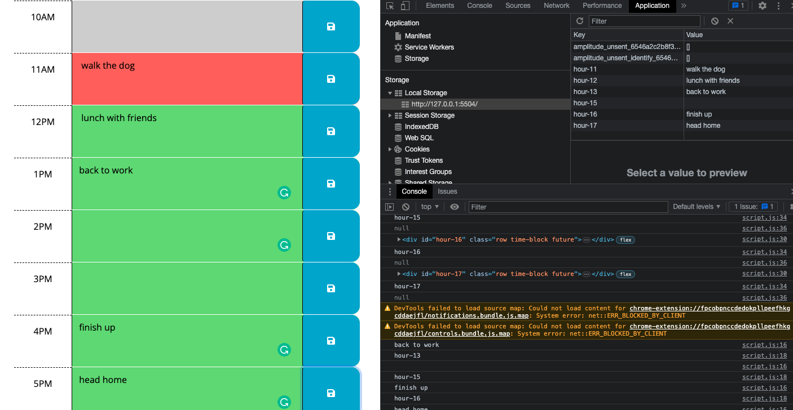

# Work Day Scheduler

## Description

A simple calendar application that allows a user to save events for each hour of the day. The information input by the user is stored in and retrieved from local storage. This challenge was an exercise in using Third Party Apis

I used the [Day.js](https://day.js.org/en/) library to work with date and time. It was extremely important to read the documentation carefully.

## User Story

```md
AS AN employee with a busy schedule
I WANT to add important events to a daily planner
SO THAT I can manage my time effectively
```

## Acceptance Criteria

```md
GIVEN I am using a daily planner to create a schedule
WHEN I open the planner
THEN the current day is displayed at the top of the calendar
WHEN I scroll down
THEN I am presented with timeblocks for standard business hours
WHEN I view the timeblocks for that day
THEN each timeblock is color coded to indicate whether it is in the past, present, or future
WHEN I click into a timeblock
THEN I can enter an event
WHEN I click the save button for that timeblock
THEN the text for that event is saved in local storage
WHEN I refresh the page
THEN the saved events persist
```

The following animation demonstrates the application functionality:

<!-- @TODO: create ticket to review/update image) -->


Here are screenshots of the application in use at different times throughout the day.








